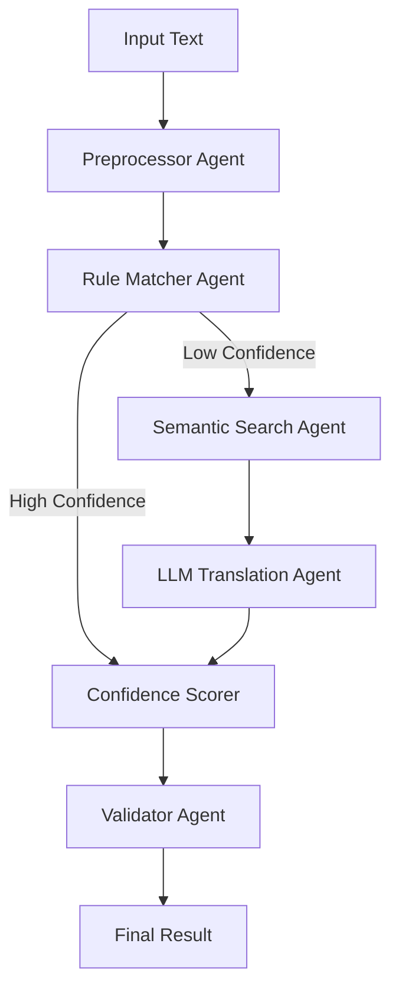

# AI Agents Architecture - Propelus Taxonomy Translation Service

## Overview
The Translation Service uses a **multi-agent system** powered by LangChain/LangGraph to intelligently map non-standard healthcare profession text to standardized taxonomy entries.

## Agent Locations in Code

### 📁 Agent Implementation Files
```
services/translation-service/app/agents/
├── __init__.py              # Agent exports
├── orchestrator.py          # Main coordinator
├── preprocessor.py          # Text normalization agent
├── rule_matcher.py          # Deterministic matching agent
├── semantic_search.py       # Vector embedding search agent
├── llm_translator.py        # GenAI translation agent
├── confidence_scorer.py     # Confidence calculation agent
└── validator.py             # Business rules validator agent
```

## Agent Pipeline Flow



## Individual Agent Details

### 1. 🔧 Preprocessor Agent
**Location**: `services/translation-service/app/agents/preprocessor.py`

**Purpose**: Standardizes and cleans input text
- Normalizes text (lowercase, remove special chars)
- Expands abbreviations (RN → Registered Nurse)
- Corrects spelling
- Tokenizes text
- Extracts entities using spaCy

**Key Methods**:
```python
async def process(input_text: str, context: dict) -> dict
```

### 2. 📏 Rule Matcher Agent  
**Location**: `services/translation-service/app/agents/rule_matcher.py`

**Purpose**: Fast deterministic matching
- Exact string matching
- Regex pattern matching
- Fuzzy string matching (Levenshtein distance)
- Alias resolution from database

**Key Methods**:
```python
async def match(normalized_text: str) -> dict
```

### 3. 🔍 Semantic Search Agent
**Location**: `services/translation-service/app/agents/semantic_search.py`

**Purpose**: Vector similarity search
- Generates embeddings using AWS Bedrock Titan
- Searches FAISS vector index
- Returns top-K similar professions
- Caches embeddings in Redis

**Key Methods**:
```python
async def search(query: str, k: int = 10) -> List[dict]
async def get_embedding(text: str) -> np.ndarray
```

### 4. 🧠 LLM Translation Agent
**Location**: `services/translation-service/app/agents/llm_translator.py`

**Purpose**: Intelligent matching using GenAI
- Uses AWS Bedrock Claude 3 Sonnet
- Context-aware translation
- Chain-of-thought reasoning
- Returns structured JSON response

**Key Methods**:
```python
async def translate(input_text: str, candidates: List[dict]) -> dict
```

### 5. 📊 Confidence Scorer Agent
**Location**: `services/translation-service/app/agents/confidence_scorer.py`

**Purpose**: Calculates match confidence
- Weighs different matching methods
- Combines multiple signals
- Historical accuracy adjustment
- Returns 0-1 confidence score

**Key Methods**:
```python
async def calculate(method: str, match: dict, metadata: dict) -> float
```

### 6. ✅ Validator Agent
**Location**: `services/translation-service/app/agents/validator.py`

**Purpose**: Ensures business rule compliance
- Validates taxonomy hierarchy
- Checks profession status (active/inactive)
- Verifies license requirements
- Regulatory body alignment

**Key Methods**:
```python
async def validate(match: dict, context: dict) -> bool
```

### 7. 🎭 Orchestrator
**Location**: `services/translation-service/app/agents/orchestrator.py`

**Purpose**: Coordinates all agents
- Manages workflow using LangGraph
- Routes between agents based on conditions
- Handles state management
- Provides unified API

**Key Methods**:
```python
async def translate(input_text: str, context: dict) -> dict
```

## Usage Example

```python
from app.agents import TranslationOrchestrator

# Initialize orchestrator
orchestrator = TranslationOrchestrator(config={
    "faiss_index_path": "/data/faiss_index",
    "redis_host": "localhost",
    "llm_model_id": "anthropic.claude-3-sonnet"
})

# Translate a profession
result = await orchestrator.translate(
    input_text="RN working in ICU",
    context={"state": "FL", "specialty": "critical_care"}
)

# Result structure
{
    "translation": {
        "profession_id": "uuid-123",
        "profession_name": "Registered Nurse",
        "profession_code": "RN-001",
        "confidence": 0.95
    },
    "alternatives": [...],
    "method": "rule_based",
    "needs_review": False,
    "processing_time_ms": 145
}
```

## Agent Communication

Agents communicate through a **state dictionary** that flows through the pipeline:

```python
state = {
    "input_text": "original text",
    "preprocessed": {...},
    "rule_match_result": {...},
    "semantic_candidates": [...],
    "llm_result": {...},
    "final_match": {...},
    "confidence": 0.85,
    "method": "semantic_search",
    "needs_review": False
}
```

## Configuration

### Environment Variables
```bash
# AWS Bedrock
AWS_REGION=us-east-1
BEDROCK_MODEL_ID=anthropic.claude-3-sonnet
EMBEDDING_MODEL_ID=amazon.titan-embed-text-v1

# Redis Cache
REDIS_HOST=localhost
REDIS_PORT=6379

# Confidence Thresholds
MIN_CONFIDENCE=0.7
REVIEW_THRESHOLD=0.8

# FAISS Index
FAISS_INDEX_PATH=/data/faiss_index
```

## Performance Optimizations

1. **Caching**: Redis caches embeddings (7-day TTL)
2. **Early Exit**: High-confidence matches skip remaining steps
3. **Batch Processing**: Groups multiple translations
4. **Async Operations**: All agents use async/await
5. **Index Optimization**: FAISS index for fast similarity search

## Adding New Agents

To add a new agent:

1. Create agent file in `services/translation-service/app/agents/`
2. Implement base interface:
```python
class NewAgent:
    async def process(self, state: dict) -> dict:
        # Agent logic here
        return state
```
3. Add to orchestrator workflow
4. Update `__init__.py` exports

## Monitoring & Debugging

Each agent logs:
- Input/output data
- Processing time
- Confidence scores
- Error states

Access logs:
```bash
docker-compose logs translation-service | grep "agent:"
```

## Testing Agents

```bash
# Run agent tests
cd services/translation-service
pytest tests/agents/

# Test individual agent
pytest tests/agents/test_semantic_search.py
```