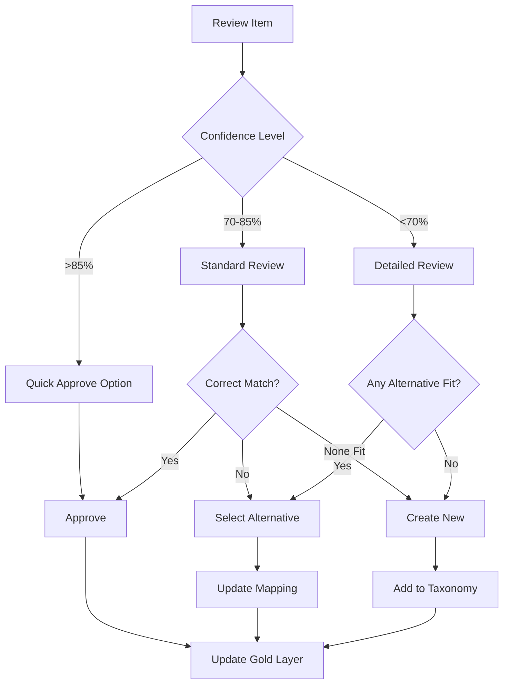

# Confidence Scoring and Human Review Workflow

## Overview
The Propelus Taxonomy Framework implements a sophisticated confidence scoring system that determines when human intervention is required. This document details the scoring methodology, thresholds, and human review workflow.

## Confidence Scoring System

### Score Ranges and Actions

| Confidence Range | Classification | Action | Human Review |
|-----------------|---------------|---------|--------------|
| 100% | Perfect Match | Auto-approve | No |
| 90-99% | High Confidence | Auto-approve (configurable) | Optional |
| 70-89% | Medium Confidence | Flag for review | Yes |
| 50-69% | Low Confidence | Require review | Yes |
| <50% | Very Low | Manual mapping required | Yes |

### Scoring Components

#### 1. Deterministic Rules (100% Confidence)
Rules that guarantee correct mapping:
- Exact string match
- Known aliases from database
- Previously approved mappings
- Validated regex patterns

#### 2. AI/LLM Scoring (50-99% Confidence)
Multiple factors contribute to AI confidence:

```python
def calculate_ai_confidence(factors):
    score = 0.0

    # Semantic similarity (0-40 points)
    score += factors['semantic_similarity'] * 40

    # Context match (0-20 points)
    if factors['state_match']:
        score += 10
    if factors['specialty_match']:
        score += 10

    # Abbreviation match (0-15 points)
    if factors['abbreviation_match']:
        score += 15

    # Historical accuracy (0-15 points)
    score += factors['historical_accuracy'] * 15

    # String similarity (0-10 points)
    score += factors['levenshtein_ratio'] * 10

    return min(score, 99)  # Cap at 99% for AI
```

### Confidence Calculation Examples

#### Example 1: High Confidence Match
```json
{
  "input": "RN - Critical Care",
  "match": "Registered Nurse - Critical Care Specialty",
  "factors": {
    "semantic_similarity": 0.92,
    "abbreviation_match": true,
    "specialty_match": true,
    "historical_accuracy": 0.85
  },
  "confidence": 94,
  "action": "auto_approve"
}
```

#### Example 2: Medium Confidence Match
```json
{
  "input": "ICU Nurse Practitioner",
  "match": "Critical Care Nurse Practitioner",
  "factors": {
    "semantic_similarity": 0.75,
    "abbreviation_match": false,
    "specialty_match": true,
    "historical_accuracy": 0.70
  },
  "confidence": 78,
  "action": "flag_for_review"
}
```

## Human Review Workflow

### Review Queue Management

#### Queue Priority System
```python
class ReviewPriority(Enum):
    CRITICAL = 1  # Customer waiting, high volume
    HIGH = 2      # New customer onboarding
    MEDIUM = 3    # Regular updates
    LOW = 4       # Historical cleanup

def calculate_priority(mapping):
    if mapping['customer_type'] == 'enterprise':
        return ReviewPriority.CRITICAL
    elif mapping['is_new_customer']:
        return ReviewPriority.HIGH
    elif mapping['confidence'] < 60:
        return ReviewPriority.HIGH
    else:
        return ReviewPriority.MEDIUM
```

#### Queue Interface
```sql
-- Review queue view
CREATE VIEW review_queue AS
SELECT
    m.mapping_id,
    m.input_text,
    m.suggested_match,
    m.confidence,
    m.priority,
    m.created_date,
    COUNT(a.alternative_id) as alternative_count
FROM silver_mapping_taxonomies m
LEFT JOIN mapping_alternatives a ON m.mapping_id = a.mapping_id
WHERE m.status = 'pending'
GROUP BY m.mapping_id
ORDER BY m.priority, m.created_date;
```

### Review Interface Components

#### 1. Mapping Review Screen
```yaml
Display Elements:
  - Original Input:
      Text: "Advanced Practice Psychiatric Nurses"
      Source: "Customer XYZ Taxonomy"
      Attributes: ["State: FL", "License: APRN"]

  - AI Suggestions:
      Primary:
        Match: "Advanced Practice Registered Nurse - Psychiatry"
        Confidence: 85%
        Reasoning: "Strong semantic match, specialty alignment"

      Alternatives:
        - Match: "Psychiatric Mental Health Nurse Practitioner"
          Confidence: 72%
          Reasoning: "Common alternative title"

        - Match: "Advanced Practice Nurse"
          Confidence: 60%
          Reasoning: "Generic match, missing specialty"

  - Context Information:
      Customer: "Healthcare System ABC"
      Previous Mappings: [List of similar approved mappings]
      Frequency: "Appears 127 times in customer data"

  Actions:
    - Approve Primary
    - Select Alternative
    - Create New Mapping
    - Reject All
    - Request More Information
```

#### 2. Bulk Review Interface
For handling multiple similar mappings:
```python
def bulk_review_suggestions():
    # Group similar unmapped items
    groups = group_by_similarity(pending_mappings)

    for group in groups:
        suggestion = {
            'items': group.items,
            'common_pattern': extract_pattern(group),
            'suggested_mapping': find_best_match(group),
            'apply_to_all': True
        }
        yield suggestion
```

### Review Decision Tree



### Human Review Actions

#### 1. Approve Mapping
```python
def approve_mapping(mapping_id, reviewer_id):
    # Update mapping status
    update_mapping_status(mapping_id, 'active')

    # Record decision
    log_review_decision({
        'mapping_id': mapping_id,
        'action': 'approved',
        'reviewer': reviewer_id,
        'timestamp': datetime.now()
    })

    # Reject alternatives
    reject_alternatives(mapping_id)

    # Move to gold layer
    promote_to_gold(mapping_id)

    # Update ML training data
    add_to_training_set(mapping_id, positive=True)
```

#### 2. Select Alternative
```python
def select_alternative(mapping_id, alternative_id, reviewer_id):
    # Promote alternative to primary
    promote_alternative(alternative_id)

    # Reject other options
    reject_other_alternatives(mapping_id, alternative_id)

    # Log decision with reasoning
    log_review_decision({
        'mapping_id': mapping_id,
        'action': 'selected_alternative',
        'alternative_id': alternative_id,
        'reviewer': reviewer_id
    })
```

#### 3. Create New Mapping
```python
def create_custom_mapping(input_data, target_node, reviewer_id):
    # Validate new mapping
    validation = validate_mapping(input_data, target_node)

    if validation.is_valid:
        # Create new mapping
        mapping_id = create_mapping({
            'input': input_data,
            'target': target_node,
            'confidence': 100,  # Human-created = 100%
            'created_by': reviewer_id
        })

        # Add to taxonomy if needed
        if target_node.is_new:
            add_to_taxonomy(target_node)

        # Train ML model with new mapping
        update_ml_model(mapping_id)
```

#### 4. Reject Mapping
```python
def reject_mapping(mapping_id, reason, reviewer_id):
    # Update status
    update_mapping_status(mapping_id, 'rejected')

    # Log rejection reason
    log_review_decision({
        'mapping_id': mapping_id,
        'action': 'rejected',
        'reason': reason,
        'reviewer': reviewer_id
    })

    # Flag for alternative processing
    create_manual_task(mapping_id)
```

## Confidence Improvement Strategies

### 1. Learning from Reviews
```python
class ConfidenceLearner:
    def update_from_review(self, mapping, decision):
        if decision == 'approved':
            # Increase confidence for similar patterns
            self.boost_pattern_confidence(mapping.pattern)
        elif decision == 'rejected':
            # Decrease confidence for this pattern
            self.reduce_pattern_confidence(mapping.pattern)

        # Update feature weights
        self.retrain_confidence_model()
```

### 2. Historical Accuracy Tracking
```sql
-- Track reviewer agreement rates
CREATE VIEW reviewer_accuracy AS
SELECT
    rule_id,
    COUNT(*) as total_mappings,
    SUM(CASE WHEN status = 'approved' THEN 1 ELSE 0 END) as approved,
    AVG(confidence) as avg_confidence,
    ROUND(100.0 * SUM(CASE WHEN status = 'approved' THEN 1 ELSE 0 END) / COUNT(*), 2) as approval_rate
FROM mapping_history
GROUP BY rule_id;
```

### 3. Dynamic Threshold Adjustment
```python
def adjust_confidence_thresholds():
    # Analyze recent review patterns
    recent_reviews = get_recent_reviews(days=30)

    # Calculate optimal thresholds
    if recent_reviews.false_positive_rate > 0.1:
        # Too many auto-approvals being corrected
        increase_threshold(5)
    elif recent_reviews.approval_rate > 0.95:
        # Very high approval rate, can lower threshold
        decrease_threshold(3)
```

## Review Metrics and KPIs

### Key Metrics
1. **Review Queue Depth**: Number of items pending review
2. **Average Review Time**: Time from flag to decision
3. **Approval Rate**: Percentage of AI suggestions approved
4. **False Positive Rate**: Auto-approvals later corrected
5. **Reviewer Throughput**: Items reviewed per hour

### Dashboard Queries
```sql
-- Daily review statistics
SELECT
    DATE(review_date) as date,
    COUNT(*) as items_reviewed,
    AVG(confidence) as avg_confidence,
    SUM(CASE WHEN action = 'approved' THEN 1 ELSE 0 END) as approved,
    SUM(CASE WHEN action = 'rejected' THEN 1 ELSE 0 END) as rejected,
    AVG(EXTRACT(EPOCH FROM (review_time - created_time))/3600) as avg_hours_to_review
FROM review_log
WHERE review_date >= CURRENT_DATE - INTERVAL '30 days'
GROUP BY DATE(review_date)
ORDER BY date DESC;
```

### Performance Targets
- Queue depth < 100 items
- Average review time < 4 hours
- Approval rate > 80%
- False positive rate < 5%
- Reviewer throughput > 50 items/hour

## Automation Opportunities

### 1. Pattern-Based Auto-Approval
```python
def identify_auto_approval_patterns():
    # Find patterns with 100% approval rate
    patterns = query("""
        SELECT pattern, COUNT(*) as count
        FROM review_log
        WHERE action = 'approved'
        GROUP BY pattern
        HAVING COUNT(*) > 10
        AND MIN(confidence) > 85
    """)

    # Create new deterministic rules
    for pattern in patterns:
        create_rule({
            'type': 'pattern_match',
            'pattern': pattern,
            'confidence': 100,
            'auto_approve': True
        })
```

### 2. Batch Processing Similar Items
```python
def batch_process_similar():
    # Group pending items by similarity
    groups = cluster_pending_mappings()

    for group in groups:
        if group.similarity > 0.95:
            # Present as single review item
            create_batch_review({
                'items': group.items,
                'count': len(group.items),
                'representative': group.centroid,
                'action': 'review_once_apply_all'
            })
```

### 3. Smart Routing
```python
def route_to_reviewer(mapping):
    # Route based on expertise
    if mapping.category == 'nursing':
        return find_reviewer('nursing_specialist')
    elif mapping.confidence < 50:
        return find_reviewer('senior_reviewer')
    else:
        return find_reviewer('available')
```

## Quality Assurance

### Review Auditing
- Random sampling of auto-approved items
- Periodic review of rejected mappings
- Cross-reviewer consistency checks

### Training and Calibration
- New reviewer onboarding process
- Regular calibration sessions
- Review guidelines and examples

### Continuous Improvement
- Weekly review of difficult cases
- Model retraining based on reviews
- Process optimization workshops

## Implementation Checklist

- [ ] Set up confidence scoring algorithm
- [ ] Configure auto-approval thresholds
- [ ] Build review queue interface
- [ ] Implement reviewer assignment logic
- [ ] Create audit trail system
- [ ] Set up metrics dashboard
- [ ] Deploy learning feedback loop
- [ ] Document review guidelines
- [ ] Train review team
- [ ] Monitor and optimize